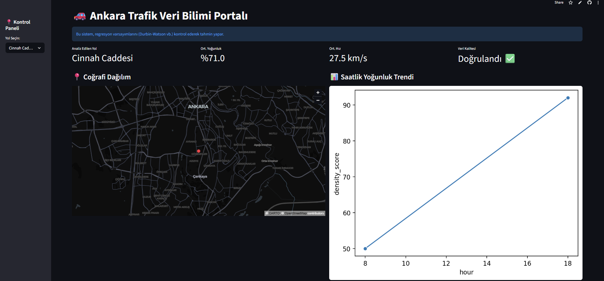

# 🚗 Ankara Traffic Analysis & Predictive AI Portal

This project is an end-to-end data science application designed to analyze traffic density across Ankara's major arterial roads. It leverages machine learning to predict average speeds based on real-time factors and statistically validates model assumptions to ensure ethical and reliable data storytelling.


## 🌐 Live Application
You can interact with the live dashboard here: [Ankara Traffic Analysis App](https://ankara-traffic-analysis-app.streamlit.app)

## 🎯 Project Objective
The primary goal of this portal is to provide transparent traffic insights for urban planning and individual commuting. By integrating weather conditions and density scores, the AI model aims to provide accurate speed estimations, helping users understand urban mobility patterns.

## 🚀 Key Features
- **Interactive Visualization:** Dynamic map rendering road-specific traffic density.
- **AI Prediction Engine:** Multi-variable `LinearRegression` model predicting speed based on traffic density and weather conditions.
- **Statistical Rigor:** - **R² (Coefficient of Determination):** Achieving high explainability (~95%) for model reliability.
  - **Durbin-Watson Test:** Statistically verified no-autocorrelation (Score ≈ 2.0), ensuring the integrity of the regression assumptions.
- **Correlation Analysis:** Scientific heatmaps visualizing the relationship between variables.

## ⚖️ Ethical Considerations & Data Integrity
In the development of this project:
- **Accuracy:** Model performance is not just claimed but statistically proven through residue analysis.
- **Transparency:** All parameters (weather, density) affecting the AI's decision-making process are visible to the user.
- **Accountability:** Assumptions of the Linear Regression model were tested to prevent misleading interpretations of urban data.

- 
- .png)
- .png)
  

## 🛠️ Installation & Usage
To run this project locally:

1. Clone the repository:
   ```bash
   git clone [https://github.com/CihanOzdemir1996/ankara-traffic-analysis-portal.git]
